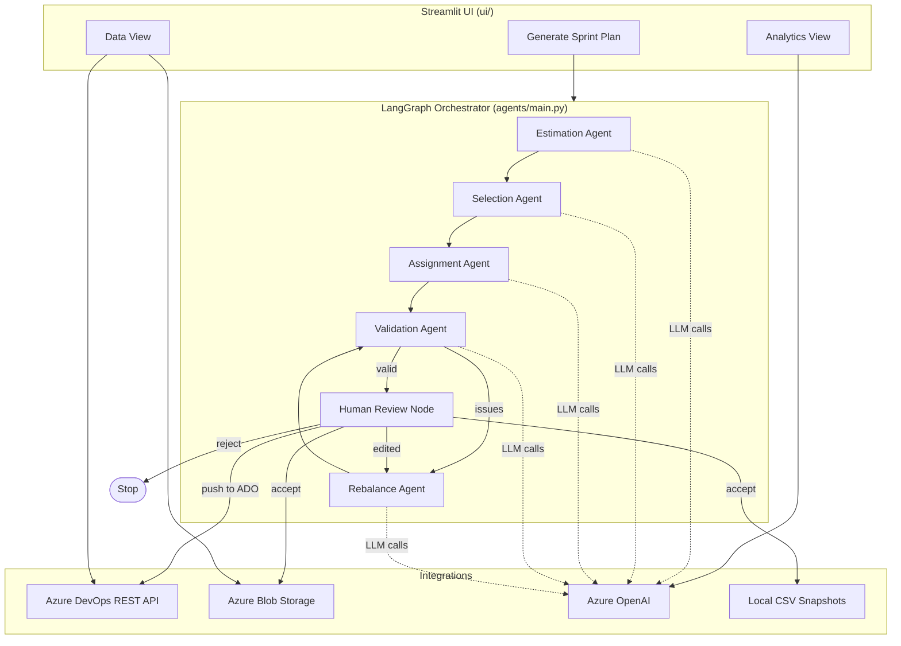
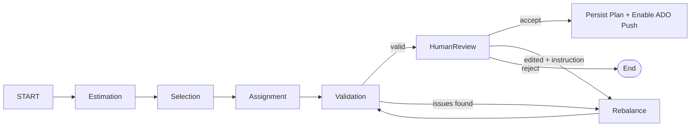

<div align="center">

# 📋 ADO Planner

### AI-Assisted Sprint Planning for Azure DevOps

*A multi-agent LLM pipeline that automates sprint estimation, selection, assignment, and rebalancing — with a human always in the loop before anything touches Azure DevOps.*

[](https://www.python.org/)
[](https://streamlit.io/)
[](https://www.langchain.com/langgraph)
[](https://azure.microsoft.com/en-us/products/ai-services/openai-service)
[](https://azure.microsoft.com/en-us/products/devops)
[](https://www.docker.com/)

</div>

> **📌 About this repository**
> This repo contains the full documentation and architecture for **ADO Planner**. The source code lives in a private repository. Reach out if you'd like a walkthrough or a closer look at the implementation.

---

## Table of Contents

- [Why ADO Planner](#-why-ado-planner)
- [Key Features](#-key-features)
- [Architecture](#-architecture)
- [Agent Pipeline](#-agent-pipeline)
- [Tech Stack](#-tech-stack)
- [Project Structure](#-project-structure)
- [Getting Started](#-getting-started)
- [Environment Variables](#-environment-variables)
- [Running the App](#-running-the-app)
- [Docker](#-docker)
- [Application Walkthrough](#-application-walkthrough)
- [Data & Persistence](#-data--persistence)

---

## 🎯 Why ADO Planner

Sprint planning in Azure DevOps is usually a manual, spreadsheet-heavy process — someone estimates effort, someone else decides what fits in the sprint, and someone manually assigns tasks while trying to keep workloads balanced.

**ADO Planner automates that workflow end-to-end**, while keeping a human firmly in control of the final decision. Nothing is written back to Azure DevOps until a plan is explicitly reviewed and accepted.

## ✨ Key Features

| | |
|---|---|
| 🔗 **Live Azure DevOps integration** | Pulls iterations, backlog, work items, and team members via ADO REST APIs (WIQL-based queries) and normalizes them into a consistent internal schema. |
| 🧠 **Multi-agent LLM pipeline** | Dedicated agents for estimation, selection, assignment, validation, and rebalancing, orchestrated as a LangGraph state machine with deterministic guardrails around every LLM call. |
| 👤 **Human-in-the-loop review** | Every generated plan can be accepted, edited (with a natural-language rebalance instruction), or rejected before anything is persisted or pushed to ADO. |
| ⚖️ **Capacity-aware assignment** | Task-level (not story-atomic) capacity enforcement, day-wise 8h/day scheduling with spillover detection, and utilization-balanced assignment across team members. |
| 🗣️ **Natural-language rebalancing** | Instructions like *"move dashboard tasks from Alex to Priya"* are parsed with an LLM-first + deterministic-fallback parser so rebalances are both flexible and safe. |
| 📊 **Analytics & AI insights** | Velocity, workload, and backlog analytics with LLM-generated narrative commentary. |
| 💾 **Zero-database persistence** | CSV snapshots stored locally and mirrored to Azure Blob Storage — no database provisioning required. |
| 🔁 **Push-back to Azure DevOps** | Accepted plans can create/update sprint iterations and patch work items (iteration path, assignee, remaining/original work) directly in ADO. |

## 🏗 Architecture



**Layers:**

1. **UI layer (Streamlit)** — project selection, data views, sprint configuration, plan review, and analytics dashboards.
2. **Orchestration layer (LangGraph)** — a single top-level state graph (`agents/main.py`) that sequences the planning agents and routes between validation, human review, and rebalancing.
3. **Agent layer** — five purpose-built agents, each with its own LangGraph sub-graph, prompt builder, and typed state contract.
4. **Integration layer** — Azure DevOps (read/write), Azure Blob Storage (snapshots), and Azure OpenAI (LLM calls).
5. **Tooling layer** — capacity math, JSON extraction/repair, and state mutation helpers shared across agents.

## 🔄 Agent Pipeline

The orchestrator graph in `agents/main.py` drives the full planning lifecycle:



| Agent | Module | Responsibility |
| --- | --- | --- |
| **Estimation** | `agents/logic/estimation_agent.py` | Fills missing effort estimates, priority, and risk; enforces hierarchy consistency (parent ≥ sum of children); skips the LLM entirely when all items already have complete data. Supports 0.5h increments. |
| **Selection** | `agents/logic/selection_agent.py` | Chooses which backlog tasks fit the sprint, keeping total selected hours within a target band (~150%–160% of capacity) and only ever selecting `Task`-type items. |
| **Assignment** | `agents/logic/assignment_agent.py` | Assigns tasks to team members using LLM-guided, capacity-validated decisions with a deterministic scoring fallback (skill, preference, experience, capacity fit, story continuity). Produces day-wise 8h/day schedules and spillover when capacity is exceeded. |
| **Validation** | `agents/logic/validation_agent.py` | Checks assignment completeness, task validity (only tasks assigned, never stories/features/epics), and story grouping — scoped intentionally to avoid endless rebalance loops over unavoidable imbalance. |
| **Rebalance** | `agents/logic/rebalance_agent.py` | Re-distributes work in response to validation issues or a free-text user instruction, using an LLM-first parser with deterministic fallback extraction (target user, story/task IDs, keywords) for safe, explicit execution. |

Each agent lives under `agents/logic/`, with its prompt builder in `agents/prompts/` and its typed state contract in `agents/states/`. The orchestrator caps rebalance loops at 3 iterations and short-circuits when a rebalance pass produces no material change.

## 🧰 Tech Stack

| Layer | Technology |
| --- | --- |
| UI | [Streamlit](https://streamlit.io/) |
| Agent orchestration | [LangGraph](https://www.langchain.com/langgraph) |
| LLM provider | Azure OpenAI |
| Source data | Azure DevOps REST APIs (WIQL, work items, iterations, teams) |
| Persistence | CSV files + Azure Blob Storage |
| Data processing | Pandas |
| Charts | Plotly / Altair (via Streamlit) |
| Runtime | Python 3.11 |
| Containerization | Docker |

## 📁 Project Structure

```
agents/                     # LangGraph orchestrator + individual planning agents
  main.py                   # Top-level orchestrator graph (estimation -> ... -> rebalance)
  logic/                    # Agent implementations (estimation, selection, assignment, validation, rebalance)
  prompts/                  # Prompt builders per agent
  states/                   # Typed state contracts (TypedDict) per agent + global state
  utils/                    # Agent-level helper utilities

services/                   # Integration + business logic services
  ado_client.py              # Azure DevOps REST client (read + write)
  blob_service.py             # Azure Blob Storage read/write for snapshots
  csv_service.py               # Local CSV persistence (data/<project>/...)
  data_normalizer.py           # Raw ADO payload -> normalized schema
  preprocess_service.py        # Task preprocessing/grouping for planning
  daywise_scheduler.py         # AI-assisted day-wise task scheduling
  llm_service.py               # Azure OpenAI call gateway
  ai_analytics.py               # LLM-generated analytics commentary
  analytics_engine.py            # Deterministic analytics metrics

tools/                      # Shared low-level utilities used by agents
  capacity_tool.py            # Member/team capacity calculation
  state_tool.py                # State mutation helpers (assign, spillover, reasons)
  state_initializer_tool.py     # Global state bootstrap
  json_tools.py                  # Robust LLM JSON extraction/repair
  blob_tool.py                    # Plan/estimate save-load helpers

ui/                         # Streamlit application
  streamlit_app.py            # Entry point, auth gate, project selection, tab routing
  tabs/
    sprint_planner_tab/        # Sprint configuration, plan generation, HIL review, ADO push
    analytics_tab/               # Velocity/workload/backlog analytics + AI insights
    data_tab/                     # Raw/normalized data browsing and hierarchy view
    test_tab/                      # Local assignment-agent testing harness
  utils/                     # UI helper utilities (data resolution, context generation)

schema/                     # Canonical column/field definitions for CSV data contracts
data/                       # Local per-project CSV snapshots (gitignored)
scripts/                    # Local dev/ops scripts (gitignored)
Dockerfile                  # Container build definition
requirements.txt            # Python dependencies
```

## 🚀 Getting Started

### Prerequisites

- Python 3.11+
- An Azure DevOps organization with:
  - A read-only PAT (Project, Team, Work Items — read)
  - A read/write PAT (Work Items — read/write, required only for pushing plans back)
- An Azure OpenAI resource with a deployed chat model
- *(Optional but recommended)* An Azure Storage account for blob-based snapshot persistence

## 🔑 Environment Variables

Copy `.env.example` to `.env` in the repository root and fill in your values:

| Variable | Required | Description |
| --- | --- | --- |
| `AZURE_OPENAI_API_KEY` | Yes | Azure OpenAI API key |
| `AZURE_OPENAI_API_ENDPOINT` | Yes | Azure OpenAI endpoint URL |
| `AZURE_OPENAI_API_VERSION` | Yes | Azure OpenAI API version |
| `AZURE_OPENAI_API_DEPLOYMENT` | Yes | Azure OpenAI chat model deployment name |
| `AZURE_DEVOPS_ORGANIZATION_URL` | Yes | Base org URL, e.g. `https://dev.azure.com/your-org` |
| `AZURE_DEVOPS_READ_ONLY_PAT` | Yes | PAT with Project/Team/Work Items **read** scope |
| `AZURE_DEVOPS_READ_WRITE_PAT` | For push-to-ADO | PAT with Work Items **read/write** scope |
| `AZURE_STORAGE_CONTAINER_CONNECTION_STRING` | Recommended | Connection string for the blob snapshot container |
| `AZURE_STORAGE_CONTAINER_NAME` | Recommended | Blob container name used for snapshots |
| `LANGSMITH_API_KEY` | Optional | Enables LangSmith tracing for the LangGraph agents |
| `LANGCHAIN_TRACING_V2` | Optional | Set to `true` to enable LangChain/LangGraph tracing |
| `LANGCHAIN_PROJECT` | Optional | LangSmith project name for traces |

> 💡 The app can also accept the organization URL and PAT directly in the sidebar at runtime, overriding the `.env` values for that session.

## ⚡ Running the App

```powershell
streamlit run ui/streamlit_app.py
```

The app opens at `http://localhost:8501`. On first load you'll be prompted for the in-app login gate before selecting an Azure DevOps project to work with.

## 🐳 Docker

```bash
docker build -t ado-planner .
docker run --env-file .env -p 8501:8501 ado-planner
```

The container installs dependencies, copies the app, and serves Streamlit on port `8501`.

## 💻 Application Walkthrough

### 1. Generate Sprint Plan
Configure a sprint (name, start date, duration, focus factor, team members, leaves, daily hours), then trigger the full agent pipeline. Review the generated plan, spillover, and day-wise schedule; **Accept** to persist and unlock ADO push, or **Rebalance** with an optional natural-language instruction to iterate.

### 2. Analytics View
Velocity, workload distribution, and backlog health metrics computed deterministically, enriched with AI-generated narrative insights.

### 3. Data View
Browse normalized work items, backlog, sprints, and hierarchy relationships pulled from Azure DevOps or the latest cached/blob snapshot.

> A local-only **Assignment Testing** harness also exists under `ui/tabs/test_tab/` for exercising the assignment agent in isolation during development.

## 💾 Data & Persistence

ADO Planner reads from Azure DevOps and caches/normalizes data through three layers, in priority order:

1. **In-memory session cache** (Streamlit `session_state`) — fastest, used within a single session.
2. **Azure Blob Storage snapshot** — durable cross-session cache per project (`sprints_meta.csv`, `work_items.csv`, `backlog.csv`, `team_members.csv`, `refresh_meta.json`).
3. **Live Azure DevOps API fetch** — used on explicit refresh or cache miss; results are normalized and re-persisted to CSV + blob.

Per-project artifacts live under `data/<project>/`:

```
data/<project>/
  backlog.csv
  work_items.csv
  preprocessed_tasks.csv
  sprints_meta.csv
  team_members.csv
  refresh_meta.json
  config/<sprint_name>.json        # Sprint configuration snapshots
  estimates/work_items_estimate.csv
  sprints/<sprint_name>.csv         # Accepted plan snapshot
  sprints/<sprint_name>_daywise.csv # Day-wise member schedule
```

Column contracts for each artifact are defined centrally under `schema/` (`work_items.py`, `sprints.py`, `preprocessed_tasks.py`, `work_items_estimates.py`).

**Push to Azure DevOps** (from an accepted plan) will:
1. Create the sprint iteration if it doesn't exist, and register it under team settings.
2. Update the iteration's start/finish dates.
3. Patch each task's iteration path, `AssignedTo`, `RemainingWork`, and `OriginalEstimate`.

---

<div align="center">

*Built with Python, LangGraph, and Azure OpenAI — designed to keep humans in control of every decision an AI agent makes.*

</div>
