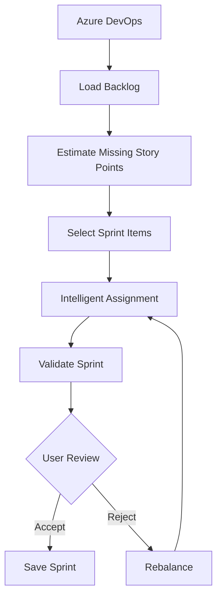

# 🚀 ADO Planner

<div align="center">


### **AI-Powered Multi-Agent Sprint Planning System for Azure DevOps**

*Automating sprint planning using Large Language Models, Multi-Agent Systems, and Intelligent Workflow Orchestration.*

</div>

---

# 📖 Overview

ADO Planner is an enterprise-grade **AI-powered Sprint Planning System** developed to automate one of the most time-consuming activities in Agile Software Development.

Traditional sprint planning requires project managers and team leads to manually:

- Estimate work items
- Select backlog items
- Check team capacity
- Assign work
- Validate workload
- Balance developer utilization
- Iterate based on stakeholder feedback

For medium and large software teams, this process often requires several hours every sprint and is heavily dependent on the experience of project managers.

ADO Planner transforms this workflow into an intelligent, AI-driven pipeline capable of generating an optimized sprint plan in minutes while ensuring that humans remain in complete control of the final decision.

The system combines **Large Language Models**, **LangGraph**, **Azure DevOps**, **Azure Blob Storage**, and **Human-in-the-Loop workflows** to produce production-ready sprint plans with minimal manual intervention.

---

# 🎯 Problem Statement

Sprint planning is one of the most important activities in Agile development.

However, it suffers from several challenges:

- Manual effort
- Subjective decision making
- Poor workload balancing
- Uneven capacity utilization
- Knowledge dependency on project managers
- Difficulties scaling to large backlogs
- Multiple iterations before finalization

These challenges become increasingly significant as:

- Team size increases
- Backlog grows
- Sprint complexity rises
- Cross-team dependencies emerge

ADO Planner addresses these challenges using an intelligent multi-agent architecture capable of reasoning over project context and automatically generating optimized sprint plans.

---

# ✨ Key Features

## 🤖 Multi-Agent AI Architecture

Instead of relying on one large prompt, the system decomposes sprint planning into specialized AI agents, each responsible for a single task.

Examples include:

- Estimation
- Backlog Selection
- Task Assignment
- Validation
- Rebalancing

This modular architecture improves scalability, maintainability, explainability, and overall planning quality.

---

## 🧠 AI-Powered Decision Making

The planner leverages Azure OpenAI models to perform reasoning-intensive tasks such as:

- Story Point Estimation
- Sprint Item Selection
- Intelligent Assignment
- Plan Validation
- Feedback Interpretation

Instead of hard-coded rules, the system makes context-aware decisions based on project data.

---

## 🔄 LangGraph Orchestration

Unlike traditional sequential pipelines, every planning stage is orchestrated using LangGraph.

This enables:

- Stateful execution
- Conditional routing
- Retry mechanisms
- Feedback loops
- Human intervention
- Dynamic workflows

---

## 👨‍💻 Human-in-the-Loop (HITL)

Automation should assist humans—not replace them.

Users can:

- ✅ Accept the generated sprint
- ✏️ Edit assignments
- ❌ Reject the plan
- 💬 Provide feedback

The system automatically incorporates feedback and generates an improved sprint plan.

---

## 📊 Capacity-Aware Planning

Every sprint plan considers:

- Team capacity
- Individual availability
- Existing workload
- Story point limits
- Sprint utilization

This prevents overloading developers while maximizing overall productivity.

---

## ⚖️ Intelligent Workload Balancing

The Assignment Agent optimizes work distribution by considering:

- Developer expertise
- Current workload
- Capacity
- Historical ownership
- Skill alignment

Resulting in fair and balanced sprint plans.

---

## ☁ Azure DevOps Integration

The planner integrates directly with Azure DevOps to retrieve:

- Product Backlog
- Sprint Backlog
- Team Members
- Capacity Information
- Work Items
- Story Points
- Task Metadata

allowing planning to be performed on live project data.

---

## 📁 Azure Blob Storage

Intermediate and final outputs are stored securely using Azure Blob Storage.

Benefits include:

- Persistent planning state
- Reusability
- Auditability
- Version management
- Cloud accessibility

---

# 🚀 Results

| Metric | Before | After |
|----------|---------|--------|
| Sprint Planning Time | ~6 Hours | ~15 Minutes |
| Manual Assignment | 100% | Automated |
| Capacity Validation | Manual | Automatic |
| Workload Distribution | Manual | AI Optimized |
| Human Review | Required | Required |
| Planning Consistency | Moderate | High |

---

# 🏗 System Architecture

```text
                        Azure DevOps
                             │
                             │
                  Fetch Backlog & Capacity
                             │
                             ▼
                    Data Preparation Layer
                             │
                             ▼
                  Global Shared Planning State
                             │
                             ▼
        ┌──────────────────────────────────────┐
        │         LangGraph Workflow           │
        └──────────────────────────────────────┘
                             │
                             ▼
                   Estimation Agent
                             │
                             ▼
                    Selection Agent
                             │
                             ▼
                   Assignment Agent
                             │
                             ▼
                    Validation Agent
                             │
                             ▼
                  Human-in-the-Loop Review
                  ┌───────────┴────────────┐
                  │                        │
             Accept Plan            Reject / Edit
                  │                        │
                  ▼                        ▼
          Save Sprint Plan        Rebalance Agent
                  │                        │
                  └──────────────┬─────────┘
                                 ▼
                       Final Sprint Plan
                                 │
                                 ▼
                     Azure Blob Storage
```

---

# 🧩 High-Level Workflow



---

# 🏛 Multi-Agent Architecture

The planner consists of multiple specialized agents working collaboratively.

| Agent | Responsibility |
|--------|---------------|
| Data Agent | Retrieves Azure DevOps data |
| Estimation Agent | Estimates missing story points |
| Selection Agent | Selects backlog items for sprint |
| Assignment Agent | Assigns work intelligently |
| Validation Agent | Validates generated sprint |
| Rebalance Agent | Improves sprint based on validation and user feedback |

Each agent performs a single well-defined task while sharing information through a centralized planning state.

---

# 🔄 Planning Pipeline

```
Azure DevOps

↓

Fetch Backlog

↓

Generate Missing Estimates

↓

Select Sprint Backlog

↓

Assign Developers

↓

Validate Plan

↓

Human Review

↓

Approve / Reject

↓

Rebalance (if needed)

↓

Store Final Sprint
```

---

# 🧠 Design Principles

The project was built around several core engineering principles:

- Modular Architecture
- Agent Specialization
- Single Source of Truth
- Explainable AI Decisions
- Human Oversight
- Cloud Native Design
- Scalability
- Extensibility
- Enterprise Readiness
- Minimal Manual Intervention

---
